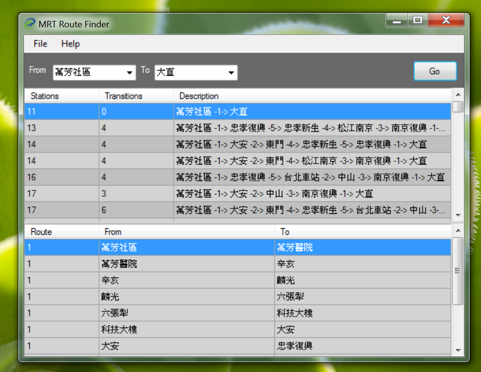

# MRTSharp

2014 Weizhong Yang (a.k.a zonble)

## English

I've been not programming on Windows platform for a while. However, recently I learned about that [Microsoft released Visual Stduio Community 2013](http://channel9.msdn.com/Events/Visual-Studio/Connect-event-2014/040), a full-fratured IDE for free and I guess it is not bad to give it a try. I downloaded and installed it, then I think I got to write something.

In the meanwhile, Taipei Metro Sungshan line is opening, and the city also changes the routing among all the metro lines. Thus, people in Taipei have to change their behavior on taking metro transit. The application helps to know the routing between two Taipei Metro stations.

The application is developed with Visual C# programming language. To compile and run it, you need to

- Download and install **[Visual Studio 2013 Community](http://www.visualstudio.com/products/visual-studio-community-vs)**. A Microsoft account is required.
- Open the project file MRTSharp.sln.
- Press on the "Start" button on the toolbar of Visual Studio.
- Done!

## 中文

我已經一陣子沒在 Windows 上面寫程式了。

這兩天看到微軟[推出了 Visual Studio 2013 的 Community 版本](http://channel9.msdn.com/Events/Visual-Studio/Connect-event-2014/040)，抓下來裝裝看之後，心血來潮寫了一個小練習。因為最近台北捷運松山線通車，同時也改變了台北捷運的轉乘路線與市民的搭乘習慣，所以這個練習，一個用來計算兩個捷運站之間如何轉乘以及要搭多少站的小練習。

整個程式都使用 Visual C# 開發。要編譯這個專案，請

- 下載並安裝 **[Visual Studio 2013 Community](http://www.visualstudio.com/products/visual-studio-community-vs)** ，您應該會需要一個微軟的帳號才又辦法下載
- 開啟專案檔案 MRTSharp
- 按下 Visual Studio 工具列上的 Start 按鈕，便可以開始編譯